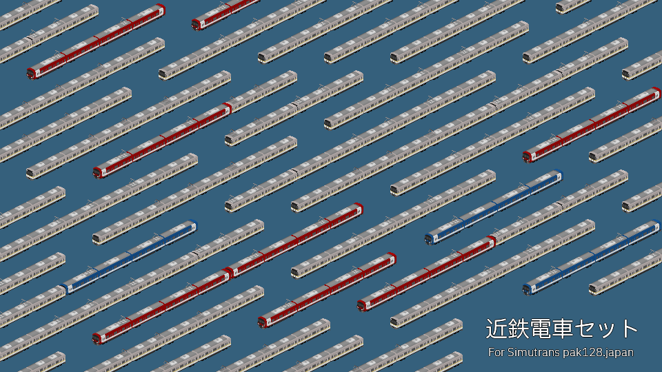

# 近鉄電車セット
- 作者：[あるみどり/G_alumi](https://x.com/G_alumi)
- ライセンス：CC BY-NC-SA

8A系・シリーズ21等の新しめな近鉄電車のセットです。

## 更新履歴<!-- updateHistory -->
### v1.0.1
- 8A系・1A系のトイレ位置を修正・向きによって白帯の太さが違ったのを修正

### v1.0.0
新しめな通勤車を実装
- 8A系・1A系を追加
- 9820系・9020系・5820系・9230系を追加

## 個別解説
### 8A系・1A系

2024年に運用を開始した奈良線向け8A系と2025年度より投入の大阪・名古屋線向け1A系です。

組成例
| Mc		| T			| M			| Mc		| 備考 |
|:-:		|:-:		|:-:		|:-:		|:--|
| 8A4		| 8A3		| 8A2		| 8A1		||
| 8A4		| 8A3(WC)	| 8A2		| 8A1		| 2026年度以降のトイレ付き形態 |
| 1A4		| 1A3		| 1A2		| 1A1		| (実在しないトイレ無しの形態) |
| 1A4		| 1A3(WC)	| 1A2		| 1A1		||
| <大阪難波 ||| 近鉄奈良> ||

また、2両単位で中間車を増減できます。

---
### 9820系・9020系

2000年頃に導入された「シリーズ21」の中でロングシートの形式です。
奈良線所属の編成は阪神線直通対応です。

組成例
| Tc	| M		| M		| T		| M		| Tc	| 備考 |
|:-:|:-:|:-:|:-:|:-:|:-:|:--|
| 9720	| 9820	| 9620	| 9520	| 9420	| 9320	||
| <大阪難波 ||||| 近鉄奈良> ||

| Mc	| Tc	| 備考 |
|:-:|:-:|:--|
| 9020	| 9320	| (Tc9120はTc9320で代用) |
| <大阪難波 | 近鉄奈良> ||

6両の9520,9420を抜いた4両編成も組成できます。

---
### 5820系(50番台)

2000年頃に導入された「シリーズ21」の中でLCカーの形式です。

トイレが設置されている大阪線の仕様です。(奈良線向けは見た目が変わらないので9820系で代用してください)

組成例
| Tc	| M		| M		| T		| M		| Tc	| 備考 |
|:-:|:-:|:-:|:-:|:-:|:-:|:--|
| 5750	| 5850	| 5650	| 5550	| 5450	| 5350	||
| <伊勢中川 ||||| 大阪上本町> ||

6両の5550,5450を抜いた4両編成も組成できます。

---
### 3220系

2000年頃に導入された「シリーズ21」の中で烏丸線直通用車両です。

組成例
| Tc	| M		| M		| T		| M		| Tc	| 備考 |
|:-:|:-:|:-:|:-:|:-:|:-:|:--|
| 3720	| 3820	| 3620	| 3320	| 3220	| 3120	||
| <京都 ||||| 近鉄奈良> ||

6両の3320,3220を抜いた4両編成も組成できます。